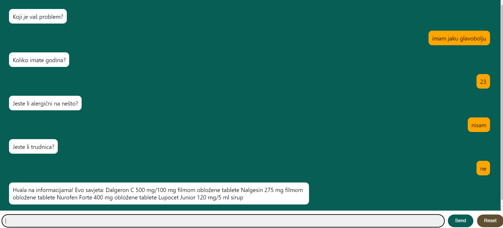

# Application name

Pharmabot

## App description

A medication consultation chatbot is an application that allows users to receive medication recommendations based on their input through a chat interface. The user will be asked several questions, such as the problem that is bothering them, age, allergies and pregnancy, after which the chatbot will analyze the answers and recommend appropriate medicines.

## How to start app

To start this app, first you need to open 2 terminals. One for server side (app.py in src directory), and one for client side. In both terminals you need to be in src directory which is inside the main directory.After that you need to type following commands,each in seperate terminal:

- npm start
- Python app.py

Before running those command you need to be sure that you have all the required dependencies installed:

- `npm install` for starting the React app

- `pip install -r requirements.txt` for starting the Python scipt

## How to use app

### Accesing the app

After the client and server sides are running, open a web browser (recommended: Chrome, Firefox) and type the address http://localhost:3000/ to access the application.

### Interaction with chatbot

- At the beginning, the first question will be displayed ("What is your problem?"). Enter the answer in the text field and press the "Send" key or the "Enter" key to send the message.

- Follow the chatbot's instructions and answer the questions that are asked.

- Once you have entered all the necessary answers, the application will process the data and display a recommendation for the appropriate medication.

### Reseting the chat

- If you want to start new conversation,  click the button 'Reset' in the bottom-right corner.

## App UI

## Author

Pharmabot application was developed by Dorijan Osmakčić. 